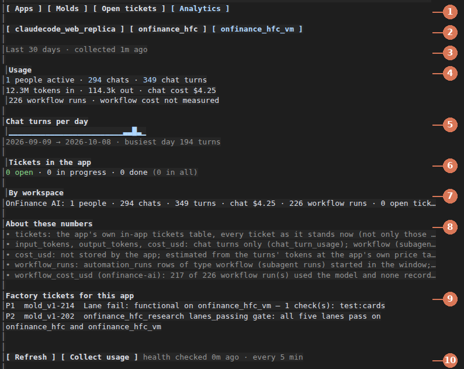

# software-factory

Read `docs/HOW_IT_WORKS.md` first. Questions the intake asks: `docs/INTAKE.md`. Operator runbook, brief to live app: `docs/RUNBOOK.md`. What a product is and ships as: `docs/PRODUCTS.md`. Inference cost per workspace: `docs/COST_MODEL.md`.

Factory 1: an operator (Fable + sol) services molds through a fixed surface and stamps applications from them. Failed applications revert to the operator.

```
Fable + sol --service--> [dm.md, browser(o/o), web search(o/o), primary_context,
    ^                     multiplayer_context, custom workflow builder] --> mold 1 (has a codebase)
    |                                                                  --> mold 2 (coming soon)
    +------------------------- revert ------------------------------+  --> mold 3 (coming soon)
```

## Layout

- `state/` — `factory.schema.json` + `factory.json` (Factory 1 instance); per-application schemas under `state/application/<app_id>/`
- `molds/` — `mold_v1` (the only one with a codebase: a snapshot of fde-agent). `mold_v2`, `mold_v3` are coming soon: a `MOLD.md` and a roadmap, nothing more. `mold_v1/testing/` holds the five test lanes and their declarations; `mold_v1/branding/rules.json` says where each branded surface lives
- `infra/` — `vercel/` (the deploy target: app + eve functions + task-workflow), `vm/` (the DigitalOcean droplet, a local verification target — it holds each app's private Postgres artifact, it does not serve the app)
- `build/` — per-app branded copies of the mold, written by `branding.py prepare`; the snapshot itself is never edited
- `.claude/`, `.agents/` — agents, skills, scripts, workflows, sandboxes for Claude Code and other agent runtimes

## Describe → deploy

```
python3 .claude/scripts/intake.py briefs/<app>.md --app <app> [--ask]   # brief -> state, asks only unresolved questions
python3 .claude/scripts/provision.py <app>                              # check, READ-ONLY: what exists, what a deploy will create, which secrets you still set
python3 .claude/scripts/provision.py <app> --set-secret NAME            # type one credential at a hidden prompt (human terminal); creates the three empty projects if absent, and says so first
python3 .claude/scripts/provision.py <app> --deploy                     # prints "about to create:", refuses if a secret is missing (nothing created), else creates projects + datastores and deploys (proves app_rw + RLS first)
python3 .claude/scripts/lanes.py <app>                                  # the five testing lanes; a fail reverts the app
```

The check creates, deletes and writes nothing remote; resource creation happens only under `--deploy` (and `--verify-db`, its
database half), after the plan is printed and every operator secret is present. Subagents `intake` and `provisioner` run `intake.py` and `provision.py` and ask the user through the harness; the `run-lanes` skill runs `lanes.py`. Questions and their resolution rules: `docs/INTAKE.md`.

## Tasking

Every mold has one or more products (`state/products.json`) and one backlog (`state/tasks/<mold_id>.jsonl`) shared by all of them. The operator works the backlog; a stage moves only when every task carrying that `advances_stage` is done: defined → stamped → lanes_passing → deployed → released.

```
python3 .claude/scripts/factory.py status        # products, stages, task counts
python3 .claude/scripts/factory.py next mold_v1  # what to do now
python3 .claude/scripts/factory.py validate      # all state files
```

Skills: `task`, `stamp`, `run-lanes`, `productize`. Agents: `mold-engineer`, `lane-tester`, `product-packager`. Workflows: `stamp-and-test`, `mold-fork`.

## Molds and products

A mold is a codebase snapshot plus its test lanes. A product is a mold under a brand, with stage gates.
Several products can share one mold, and they share that mold's backlog.

| Mold | Status | Codebase | Products (`state/products.json`) |
|---|---|---|---|
| mold_v1 | active | snapshot of fde-agent + the five testing lanes | `delivered`, `dover`, `onfinance_hfc_research` |
| mold_v2 | **coming soon** | none yet: `MOLD.md` + `roadmap.md` only | `claudecode_web_governed` |
| mold_v3 | **coming soon** | none yet: `MOLD.md` + `roadmap.md` only | `claudecode_web_research` |

Each product's current stage is in `state/products.json` and on the factory board (below); `python3 .claude/scripts/factory.py status` prints it too.

mold_v2 (agent governance, pipeline-level data isolation, budget management, performance governor) and
mold_v3 (autoresearch and SAI, multi-context + multi-role isolation per workflow) are **coming soon**
(`"status": "coming_soon"` in `state/factory.json`): neither folder contains a line of application code,
nothing has been stamped from either, and their first backlog task in both cases is to fork mold_v1 at a
recorded commit. Only mold_v1 can be stamped today.

## Factory board

Every app the factory built, in one Claude Code pane with four tabs:

- **Apps:** live health, last deploy, and the base-code version each app runs.
- **Molds:** the molds, with v2 and v3 marked coming soon, and each product's stage.
- **Open tickets:** clickable, each opening its details and a "Work on this" button.
- **Analytics:** each app's rough usage, and the tickets people raised inside it.

It ships with the factory (`plugins/factory-board`, turned on by `.claude/settings.json`). Type `/factory` in a Claude Code session started here. What each part means: `plugins/factory-board/README.md`.



## Branding

mold_v1 has no theme system of its own — product name, palette, icon and sign-in mark are hardcoded in the
snapshot — so branding is applied by copying, never by editing the mold. A product's `brand` block is copied
into the app at stamp time; `branding.py <app_id> prepare` rewrites the branded surfaces into `build/<app_id>/`
and `provision.py --deploy` builds that copy. `molds/mold_v1/branding/rules.json` pins only *where* each
surface lives; a rule that stops matching refuses the deploy rather than shipping a half-branded app.

## Working here

All commands run on the DigitalOcean VM (`ssh digitalocean`), repo at `/root/software-factory`. Refresh the mold snapshot per `molds/mold_v1/MOLD.md`. Vercel is the one committed deploy target; `target: vm` verifies an app's database locally and does not serve it (`infra/vm/README.md`).
