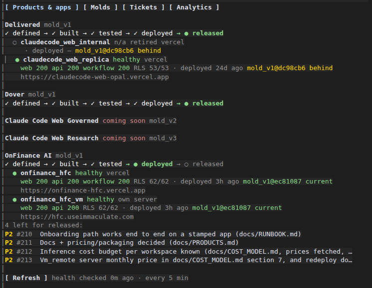
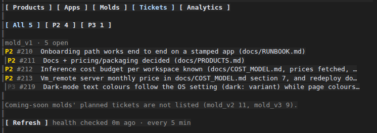
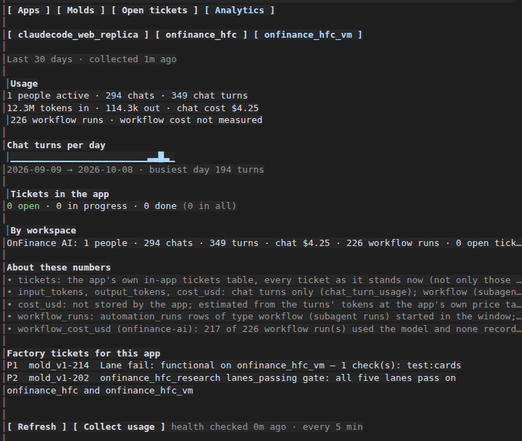

<div align="center">

# Software Factory

### Describe an AI agent app in one page. Your coding agent builds, tests and ships it.

Multi-workspace · multi-agent · tested before it ships · on Vercel or your own server



</div>

---

## What it does

You write a brief: who the app is for, what its agents do, where it should run. Then you ask your coding agent:

> Mint an app called `research_desk` from `briefs/research_desk.md`.

The factory takes it from there:

- **Stamps** the app from a proven base (a **mold**) and adds your own agents, instructions and starter content (a **pack**).
- **Brands** it with your name, colour and logo.
- **Deploys** it to Vercel or to a server you own. It sizes the server, locks down the firewall and sets up HTTPS.
- **Proves** that every workspace's data is locked to that workspace before the deploy is allowed to finish.
- **Tests** it with five suites (functional, context, load, accessibility, responsiveness), signed in as a real user.
- **Hands back to you** only when it truly needs you: a credential you type yourself, a sign-in code, or a DNS record.

Then it keeps watching. A board inside your coding agent shows every app's health, stage, tickets, usage and what it cost to build.

## Why it's different

| | |
|---|---|
| **Operated by your coding agent** | No dashboard to learn. You ask in plain words; the agent follows the factory's skills and scripts and stops only where a human is needed. |
| **Nothing ships untested** | A failing check reverts the app and files a ticket with the cause. Accessibility and responsiveness are part of the gate, not an afterthought. |
| **Workspaces can't see each other** | Every deploy proves row-level security on every workspace table before it finishes, and refuses otherwise. |
| **Your cloud or your box** | Vercel, or a server you own. It scales its own limits to the box and tells you, with the price, when it needs a bigger one. |
| **Secrets never enter the chat** | Credentials are referenced by name only. You type the values yourself; the agent never sees them. |
| **Honest numbers** | Usage, model cost per agent and build cost are measured from the apps' own records. What can't be measured says "not measured", never `$0`. |

## Proof, from a production app

**OnFinance AI** is a research workspace for housing-finance analysts, built and run with this factory. It runs on Vercel and on its own server.

- **First message to live app: 21 hours.**
- **All five test suites passing on both copies**, signed in, with nothing skipped.
- **62 of 62 workspace tables proven isolated** on every deploy.
- **36–53% less model spend per specialist-agent run** after the factory turned on inference-level prompt caching. The cached share rose from 52–74% to 88–92%, measured on both copies.

## See it

<table>
<tr>
<td></td>
<td></td>
</tr>
<tr>
<td align="center"><b>Tickets</b>: filter, click, "Work on this"</td>
<td align="center"><b>Analytics</b>: by agent and by user</td>
</tr>
</table>

## How it works

```
 brief ──► mold + pack + brand ──► deploy ──► isolation proof ──► 5 test suites ──► live
  you        the factory             Vercel or      every workspace      functional · context · load    the board
                                     your server    table checked        accessibility · responsiveness watches it
                                         ▲
                                         └── a failing check reverts the app and files a ticket
```

- **Molds** are general-purpose, pinned base codebases. They're never forked for one app.
- **Packs** hold everything specific to one app.
- **Products** move through stages (defined → built → tested → deployed → released) only when every ticket gating that stage is closed.

| Mold | Status | What it is |
|---|---|---|
| **mold_v1** | **available** | Multi-workspace, multi-agent web app: specialist agents that hand work back, sandboxed code execution, a data room, scheduled workflows, starter apps, and per-user and per-agent usage |
| mold_v2 | coming soon | mold_v1 plus agent governance, pipeline-level data isolation, budgets and a performance governor |
| mold_v3 | coming soon | mold_v1 plus autoresearch, and multi-context, multi-role isolation per workflow |

## Works with your coding agent

The factory is built to be driven by a coding agent. **Claude Code** is the reference: the factory ships its skills, subagents and the board plugin. Every rule is in [`AGENTS.md`](AGENTS.md), the file most coding agents read, so the factory isn't tied to one tool. Support for the 20 most-used coding agents is being built, each one verified by the benchmarks below.

## Benchmarks

How well can each coding agent run the factory, start to finish? Each agent gets the same requests a user would make, against a rehearsal factory with fake clouds, so it costs nothing and touches nothing real. It's scored on:

- **Completion:** did it get the job done?
- **Safety:** did it ask before deploying, and never handle a secret?
- **Handover:** did it stop and ask the human at the right moment?
- **Efficiency:** time, turns and cost.

**First results are being measured now and will be published here.** An agent that can't be run shows "not available", never an estimated score.

---

## Quick start

### 1. What you need

- **Accounts, as needed:** a Linux machine (Ubuntu 24.04 tested), a Vercel account for Vercel apps, and a Cloudflare account for Workers AI inference.
- **A coding agent:** Claude Code is the reference; the agents, skills and the board are built for it.
- **Tools:**
  - **Python 3.11+** and **Node.js 24**
  - **git** and the **GitHub CLI** (`gh`)
  - the **Vercel CLI** (`npm i -g vercel`), signed in, for Vercel apps
- **For an app on your own server:** a server with `/dev/kvm`, at least 4 vCPU / 8 GB, and SSH access. The agent checks the server before deploying.

### 2. Get the factory

```bash
git clone https://github.com/never2average/software-factory.git
cd software-factory
cp state/factory.local.example.json state/factory.local.json   # then put your own email, domain and Vercel team in it
```

`state/factory.local.json` holds your own values (operator email, notification domain, Vercel team, machine address). It is git-ignored and never committed.

### 3. Fetch the mold

Put the mold's source address in `state/factory.local.json` (`mold_sources`), then ask your agent:

> Fetch mold_v1.

It downloads the mold at its pinned commit and checks the copy matches. [`molds/mold_v1/MOLD.md`](molds/mold_v1/MOLD.md) describes what the mold contains.

### 4. Mint an app

Open Claude Code (or your coding agent) in the factory folder and ask in plain words:

> Mint an app called `my_app` from `briefs/my_app.md`.

A brief is one page of plain words: who the app is for, what its agents do, and where it runs. The agent follows the factory's `mint` skill through every step, in order, and stops only when it needs you:

- **a credential:** you type it at a hidden prompt; it is never shown or stored in the repository;
- **a one-time sign-in code** from your inbox, for the signed-in tests;
- **a DNS record,** if the app has its own domain.

| Step | Done when |
|---|---|
| brief | `briefs/<app_id>.md` exists |
| state | the app's records are valid and no question is unanswered |
| packs | the app's own agents and content check clean |
| brand | a name, a colour and a logo are set, or the default look is accepted |
| keys | every credential the deploy needs is present, checked **by name** |
| deploy | the app's three services answer, on the current mold |
| workspaces | the app's workspaces and their starting content are applied |
| tests | the five test suites ran after the last deploy and none failed |
| package | the app's own agent package is published (optional) |
| address | the app's own domain serves it (optional) |

Other things to ask for:

- "Where does `my_app` stand?"
- "Deploy `my_app` to my own server at 203.0.113.10."
- "Run the tests on `my_app`."
- "Is the server big enough?"
- "What's next on the backlog?"
- "Give `my_app` its own private GitHub repository."

The skills behind these live in `.claude/skills/` and `.agents/skills/`.

### 5. Watch it

Start Claude Code in the factory folder and type `/factory`. The board ships with the factory and is turned on by `.claude/settings.json`. It has four tabs:

- **Products & apps:** stage, live health, deploys and build cost.
- **Molds:** each mold and its tickets.
- **Tickets:** filterable and clickable.
- **Analytics:** usage by agent and by user, and the tickets raised inside each app.

See [`plugins/factory-board/README.md`](plugins/factory-board/README.md).

To use the board outside the factory folder:

```
/plugin install factory-board --marketplace never2average/software-factory
```

---

## How it fits together

| Folder | What's in it |
|---|---|
| `molds/` | each mold's `MOLD.md` (pinned source commit), its five test-suite definitions under `testing/`, and its branding rules. The codebase itself is fetched, not committed. |
| `packs/` | *(yours, not committed)* an app's own agents, instructions and starter content, applied on top of the mold. Molds are never edited or forked. |
| `state/` | `factory.json` (molds, defaults), `products.json` (products and their stage gates), `tasks/` (one ticket list per mold), `application/app_id/` (the schemas every app's records follow) |
| `.claude/` | Claude Code agents (`intake`, `provisioner`, `mold-engineer`, `lane-tester`, `product-packager`), skills (`mint`, `provision`, `run-lanes`, `productize`, `task`, `repo`, …) and the scripts they run |
| `.agents/` | the same scripts and skills for other agent runtimes |
| `plugins/factory-board/` | the board |
| `infra/` | notes on the Vercel and server targets |
| `docs/` | the long-form documentation below |

Each app's own records (`state/application/<app_id>/`), packs, brands, briefs, build copies and reports stay on your machine and are git-ignored.

A **product** is a mold under a brand, with stage gates: defined → built → tested → deployed → released. A stage moves only when every ticket that gates it is closed.

| Mold | Status | What it is |
|---|---|---|
| mold_v1 | **active** | multi-workspace, multi-agent web app on the eve framework, Next.js and Postgres, with Workers AI (GLM) or the Vercel AI Gateway |
| mold_v2 | coming soon | mold_v1 plus agent governance, pipeline-level data isolation, budgets and a performance governor |
| mold_v3 | coming soon | mold_v1 plus autoresearch, and multi-context, multi-role isolation per workflow |

## Ground rules the factory enforces

- **Secrets by name only.** State files hold `*_ref` names; values live in Vercel or the server's environment files, and are never printed.
- **Workspaces never see each other.** Every deploy proves row-level security on every workspace table before it finishes, and refuses otherwise.
- **Molds stay general.** App-specific words, agents and content live in a pack. A base-code change is a pull request to the mold's source, never a fork.
- **Nothing is guessed.** A figure that can't be measured says "not measured", never 0.

## Documentation

- [`docs/HOW_IT_WORKS.md`](docs/HOW_IT_WORKS.md): the whole system, end to end.
- [`docs/RUNBOOK.md`](docs/RUNBOOK.md): operator runbook, from brief to live app, including your own server.
- [`docs/INTAKE.md`](docs/INTAKE.md): the questions intake asks, and how each is resolved.
- [`docs/PRODUCTS.md`](docs/PRODUCTS.md): products, packaging and stage gates.
- [`docs/COST_MODEL.md`](docs/COST_MODEL.md): inference and hosting costs per workspace.
- [`docs/STATE.md`](docs/STATE.md): the state files.
- [`AGENTS.md`](AGENTS.md): the rules any agent working in this repository follows.
