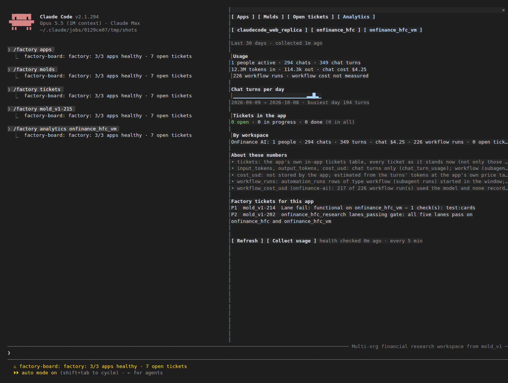
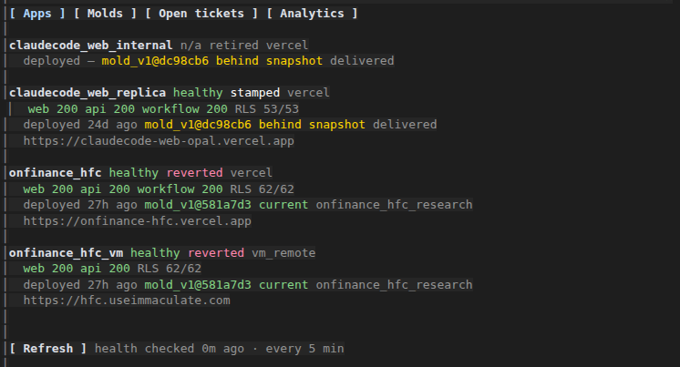
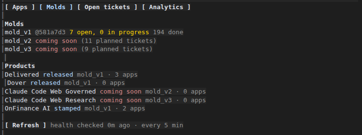
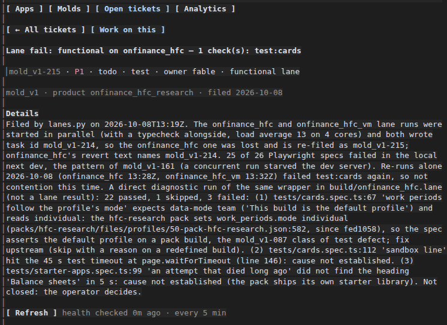
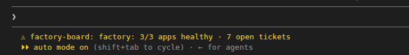

# factory-board

A Claude Code plugin that ships with the software factory. One pane, four tabs, covering every app the factory has built:

- **Apps:** whether each app is up right now, and where and when it was deployed.
- **Molds:** the base codebases and the products built on them.
- **Open tickets:** every open ticket, each one clickable.
- **Analytics:** each app's rough usage, and the tickets people raised inside it.

Type `/factory` in a Claude Code session started in the factory.



## Tabs

The tab buttons sit at the top of the pane. You can also jump straight to a tab:

| Type | Opens |
|---|---|
| `/factory apps` | Apps |
| `/factory molds` | Molds |
| `/factory tickets` | Open tickets |
| `/factory analytics onfinance_hfc_vm` | Analytics, with that app picked |
| `/factory mold_v1-215` | that ticket's details |
| `/factory refresh` | the board, after a fresh health check |

### Apps



Each app under `state/application/` gets four lines:

1. **Name and state:**
   - Live health: `healthy`, `down`, `pending`, or `n/a` for a retired app.
   - Its record status: `stamped`, `reverted` or `retired`.
   - Where it runs: `vercel`, or `vm_remote` for its own server.
2. **Health checks:** the answer from each health page the board loads itself (web, api, and on Vercel the workflow service), plus the workspace-isolation proof from the last deploy. `RLS 62/62` means all 62 workspace tables are locked to their workspace.
3. **Deploy:**
   - When it was last deployed.
   - The base-code (mold) version it runs: `current` is the factory's latest snapshot; `behind snapshot` means a redeploy would update it.
   - Its product.
4. **Address:** the app's web address.

### Molds



- **Each mold:** its snapshot version and its tickets (open, in progress, done). A mold marked `coming_soon` in `state/factory.json` shows **coming soon** and its number of planned tickets. Today that's mold_v2 and mold_v3.
- **Each product:** its stage (defined → stamped → lanes_passing → deployed → released), which mold it's built on and how many apps it has. Products of a coming-soon mold say so.

### Open tickets


- **Order:** every open and in-progress ticket of the active molds, grouped by mold, most urgent first. P1 is red, P2 amber.
- **App:** a ticket that names an app shows that app in brackets.
- **Clicking:** each ticket opens its details.



The details view shows the full title, priority, status, type, owner, lane, product, the date it was filed, the full details text and what "done" means. "Waits on" lists other tickets it depends on, and each one is clickable. You also get two buttons:

- **← All tickets:** goes back to the list.
- **Work on this:** puts `Work on factory ticket <id> …` into your prompt, ready to send.

### Analytics


1. **Tabs.**
2. **App picker:** one button per app that isn't retired.
3. **Window:** the last 30 days, and when the numbers were collected.
4. **Usage:**
   - people active, chats, chat turns;
   - tokens in and out;
   - estimated chat cost;
   - workflow (helper) runs and their cost.
5. **Chat turns per day:** one bar per day, scaled to the busiest day.
6. **Tickets in the app:** the tickets people raised inside the app itself (open, in progress, done). These are not the factory's tickets.
7. **By workspace:** the same numbers for each workspace in the app.
8. **About these numbers:** how each figure was counted, and anything that couldn't be measured. A figure that can't be measured says **not measured**, never `$0`. For example, Cloudflare Workers AI doesn't report the cost of helper runs.
9. **Factory tickets for this app:** open factory tickets that name this app. Each one is clickable.
10. **Buttons:** **Refresh** checks health again. **Collect usage** pulls fresh numbers.

The numbers come from `.claude/scripts/app_usage.py`, which the board runs every 30 minutes and on **Collect usage**. It reads each app's own database as the app's own restricted role, one workspace at a time, in read-only transactions. Only counts leave the database: no messages, no names, no email addresses. The results are kept in `reports/usage/<app>.json`, which is not committed.

## The status line

A one-line summary sits in the status line, so you can see it without opening the pane:



The board checks health every 5 minutes on its own.

## Installing

Inside the factory there is nothing to do: `.claude/settings.json` turns the plugin on from the factory's own marketplace (`.claude-plugin/marketplace.json`). Elsewhere, type this at a Claude Code prompt, answer `y` to add the marketplace, then pick a scope:

```
/plugin install factory-board --marketplace never2average/software-factory
```

The board reads the factory's records from the folder Claude Code was started in when that folder is the factory, and otherwise from `/root/software-factory`. It never changes a record, a ticket or an app.

## Developing it

- `hooks/register.tsx` holds the pane, its tabs, `/factory` and the timers.
- `hooks/board.ts` holds the pure readers of the state files and the usage report.
- `types/index.d.ts` declares the values the pane keeps.

The tests are:

- `hooks/board.test.ts` for the readers;
- `hooks/tickets-ui.test.tsx`, which clicks through tickets on the terminal and desktop surfaces against a small fake factory.

```
claude plugin validate plugins/factory-board
claude plugin test plugins/factory-board
```

The screenshots in `docs/` are real captures of the running board, taken on 2026-10-08 in a terminal 170 columns wide.
