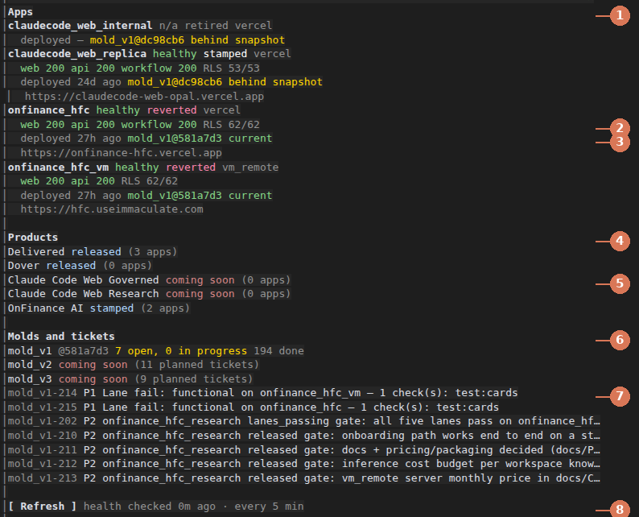

# factory-board

A Claude Code plugin that ships with the software factory. It shows every app the factory has built in one pane: whether it's up right now, where and when it was deployed, which base code it runs, what stage its product has reached, and which tickets are still open.


## What the board shows



1. **Apps.** Every app under `state/application/`. Each one shows its live health (`healthy`, `down`, `pending`, or `n/a` for a retired app), its record status from `application.json` (`stamped`, `reverted`, `retired`), and where it runs (`vercel` or `vm_remote`, your own server).
2. **Live health.** The board calls each app's health pages itself: web, api, and on Vercel the workflow service. It shows the answer code, which is `200` when the app is up. Next to it is the workspace-isolation proof recorded at the last deploy (`RLS 62/62` means all 62 workspace tables are locked to their workspace).
3. **Deploy and base code.** When the app was last deployed, and the base-code (mold) version it runs. `current` means it runs the factory's latest snapshot; `behind snapshot` means a redeploy would bring it up to date.
4. **Products.** Every product in `state/products.json` with its stage: defined → stamped → lanes_passing → deployed → released.
5. **Coming soon.** A product whose mold is marked `coming_soon` in `state/factory.json` shows "coming soon" instead of a stage. Today that's mold_v2 and mold_v3.
6. **Molds.** For each mold: the snapshot version and how many tickets are open, in progress and done. Coming-soon molds only show how many tickets are planned.
7. **Open tickets.** The open and in-progress tickets of the active molds, most urgent first (P1 before P2).
8. **Refresh.** The board refreshes on its own every 5 minutes and when you type `/factory`. Press **Refresh** to check again now.

A one-line summary also sits in the status line, so you see it without opening the pane:


## Using it

| Do this | To |
|---|---|
| `/factory` | open the board |
| `/factory refresh` | open it and wait for a fresh health check |
| **Refresh** in the pane | check again now |

The board reads the factory's records from the folder Claude Code was started in when that folder is the factory, and otherwise from `/root/software-factory`. It only reads: it never changes a record, a ticket or an app. Health checks are plain page loads of each app's public health address, with no sign-in.

## Installing

Inside the factory there is nothing to do: `.claude/settings.json` turns the plugin on from the factory's own marketplace (`.claude-plugin/marketplace.json`), so a Claude Code session started in `/root/software-factory` has it. Elsewhere, type this at a Claude Code prompt, answer `y` to add the marketplace, then pick a scope:

```
/plugin install factory-board --marketplace never2average/software-factory
```

## Developing it

- `hooks/register.tsx` holds the pane, the `/factory` command and the timer.
- `hooks/board.ts` holds the pure readers of the state files.
- `types/index.d.ts` declares the values the pane keeps.

Check it with:

```
claude plugin validate plugins/factory-board
claude plugin test plugins/factory-board
```

The screenshots in `docs/` are real captures of the running board, taken on 2026-10-08 in a terminal 170 columns wide.
